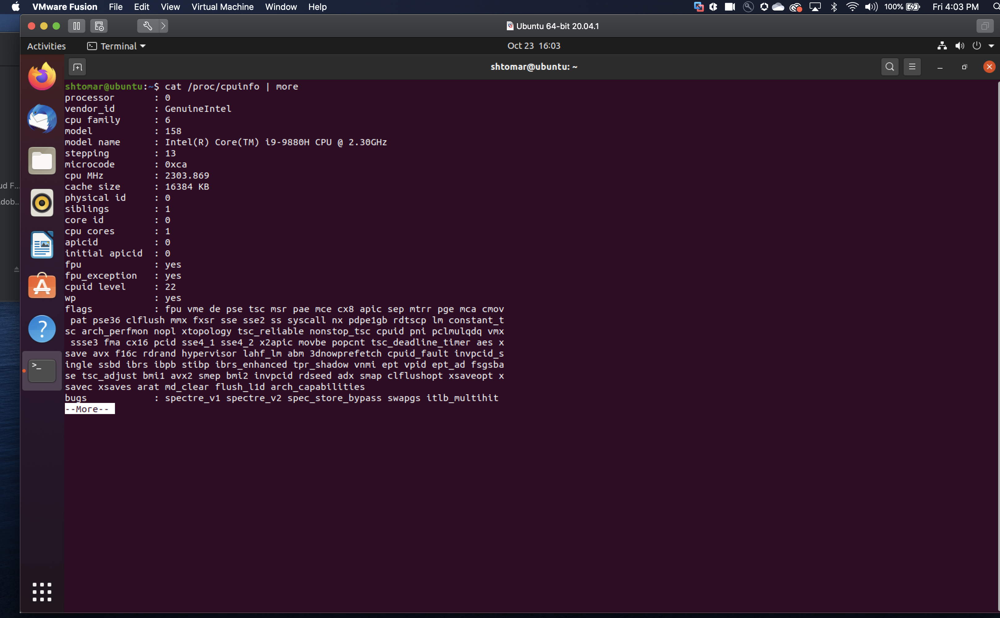
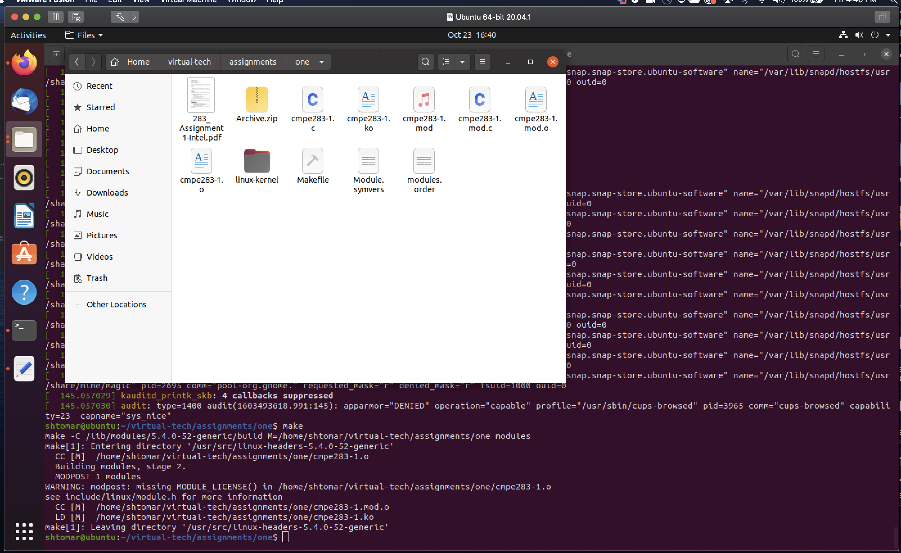
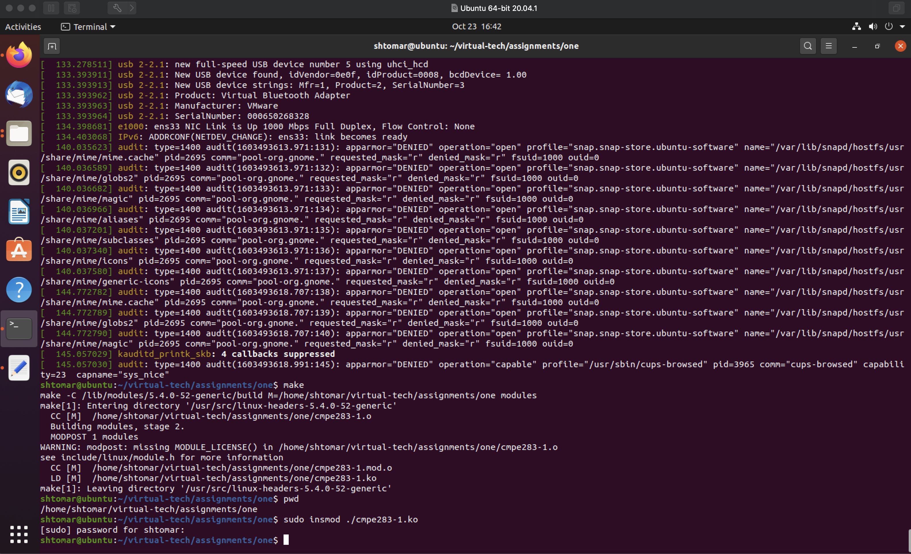
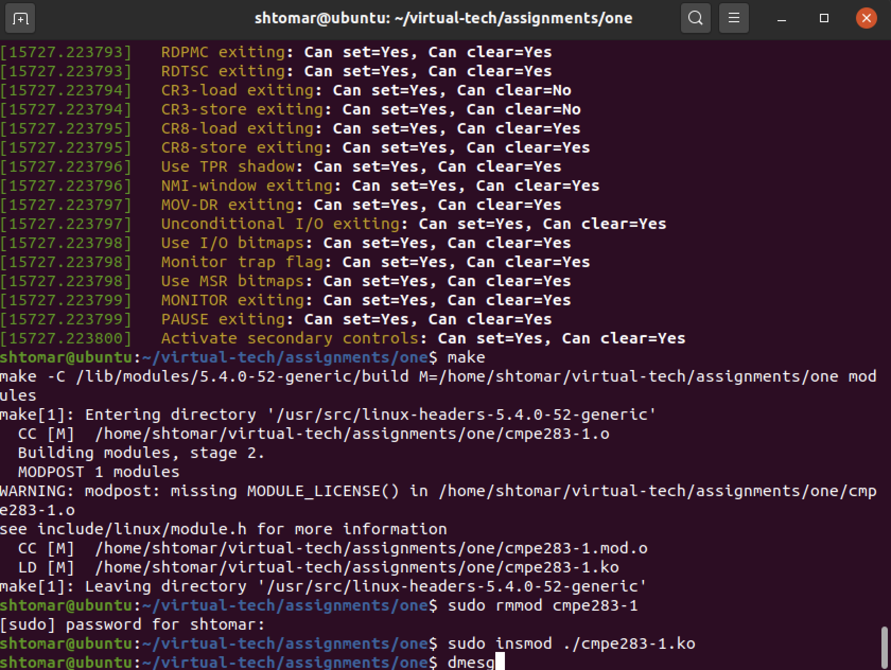
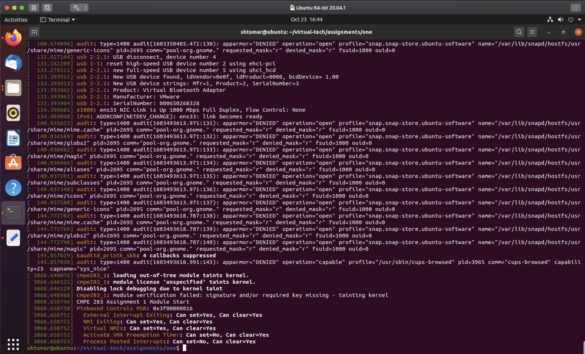
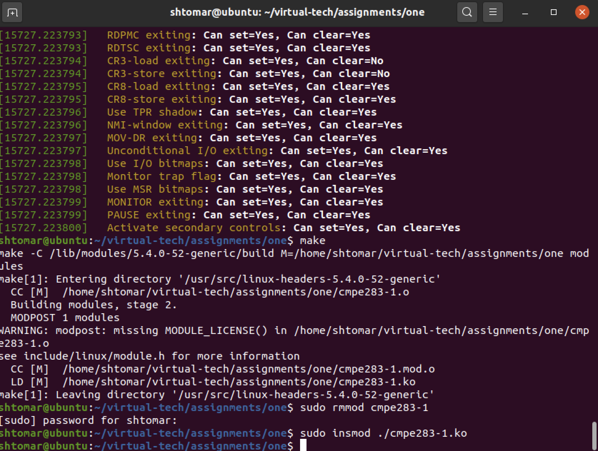
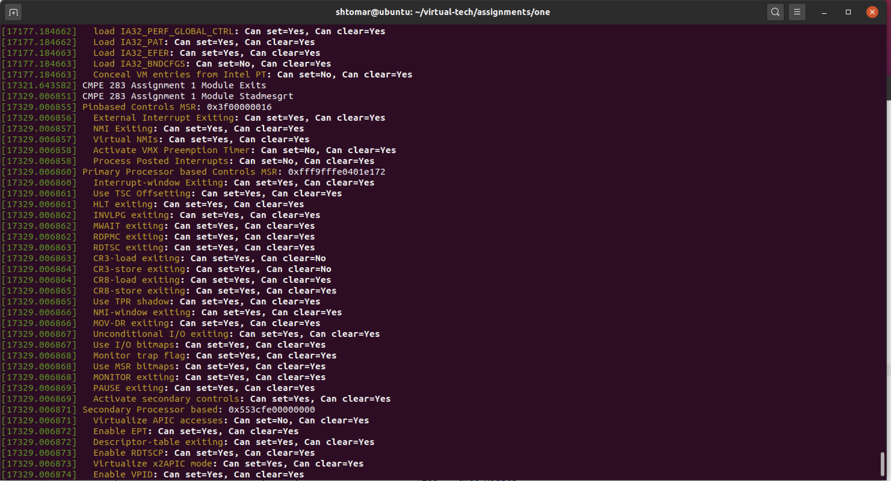

# Author
**Shivam Tomar(shivam.tomar@sjsu.edu)**

# Team details
We worked in a group of two for this assignment.

### Team members
1).  Shivam Tomar(SJSU ID: 015218203)
2).  Srujana Koripalli(SJSU ID: 013859651)

### Team members Contribution

#### Shivam Tomar
Shivam did the environment set up, coding.

#### Srujana
Srujana also researched and configured the VMWare Hypervisor, settiup up Linux image. Helped with coding and testing the out of MSR's for correctness.

# CMPE283(Virtualization Technologies) Assignment 1
 ## Following steps were followed as part of the assignment
 1. Download and install VMWare Fusion on Mac.
 2. Download the image(iso) of 64 bit Ubuntu.
 3. Create Ubuntu VM using the image downloaded in setp 2. Allocated 8 GB of memory, 2 VCPU's, 200 GB of SSD storage and enabled nested virtualization under CPU settings.
 4. Run the Ubuntu VM.
 5. Execute **cat /proc/cpuinfo | more** to verify that nested virtualization is enabled in VM machine. The result of shell command is shown in attached screenshot.
 
 6. Created the github repo for this project and clone it locally.
 7. Compile the provided module file **cmpe283-1.c**. Install the compiled module using **insmod**. It is shown by the screenshots attached with this step.
 
 
 8. Run the command **dmesg** which shows all the system logs. Verify that the logs for pinbasedcontrol are present as shown in attached screenshot.
 
 
9. Added the code, to read and print the VMX configuration for Process based, secondary process based, entry and exit MSRs. The updated code is present in the file CMPE283-1.c.
10. Compile the module using Makefile to generate updated ko file.
11. Uninstall the previously install module using **rmmod cmpe283-1**.
12. Install the updated module using command **insmod ./cmpe283-1.ko**.

13. Print all the logs using **dmesg**. It is shown in the attached screenshot.

14. Verify that the VMX capabilities for all the MSRs are displayed in the logs. The logs for MSRs are shown in the attached screenshot.

15. Stage, commit and push the changes to remote github repo.
